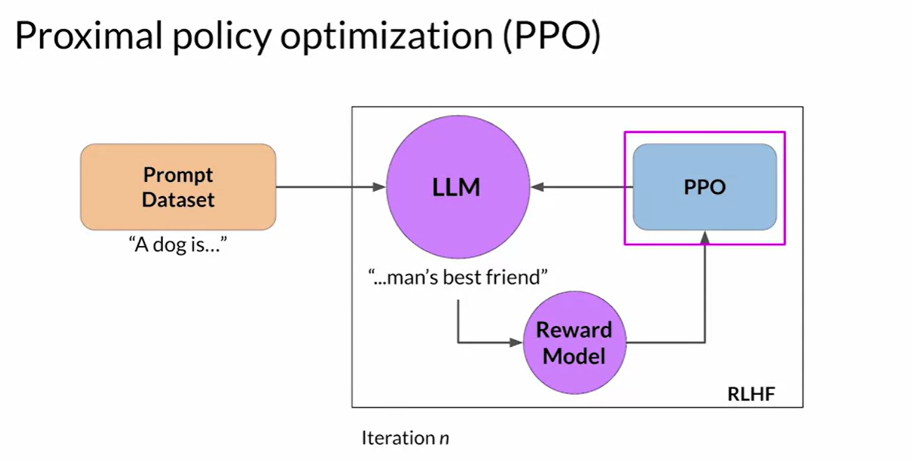
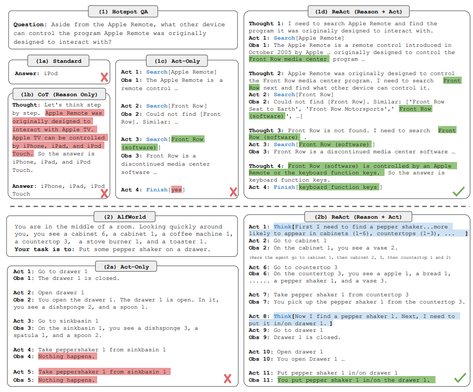

**1.** Here are 3 common types of PEFT methods:
Additive PEFT: This approach adds new parameters to the pre-trained model. These new parameters are specifically designed for the fine-tuning task, allowing the model to learn new information without significantly altering the original knowledge. Imagine adding a new tool to your toolbox for a specific job.

Partial PEFT: This method focuses on fine-tuning only a selected subset of the pre-trained model's parameters. The selection process can involve identifying the parts most relevant to the new task. It's like focusing on sharpening a specific part of your existing axe for a new chopping task.

Reparameterization PEFT: This technique involves reformulating the existing parameters of the pre-trained model in a more efficient way. This allows the model to adapt to the new task without introducing a significant number of new parameters. Think of it like reconfiguring the handle of your axe to improve its grip for a new task.

**2.** When using Reinforcement Learning with Human Feedback (RLHF) to align large language models with human preferences, what is the role of human labelers?
To score prompt completions, so that this score is used to train the reward model component of the RLHF process.
Note: In RLHF, human labelers score a dataset of completions by the original model based on alignment criteria like helpfulness, harmlessness, and honesty. This dataset is used to train the reward model that scores the model completions during the RLHF process.

**3.** HELPFUL? HONESTY? HARMFULL?
PPO : Proximal Policy Optimization 

**4.** advanced prompting technique using PAL, ReAct

Image: The figure provides a comprehensive visual comparison of different prompting methods in two distinct domains. The first part of the figure (1a) presents a comparison of four prompting methods: Standard, Chain-of-thought (CoT, Reason Only), Act-only, and ReAct (Reason+Act) for solving a HotpotQA question. Each method's approach is demonstrated through task-solving trajectories generated by the model (Act, Thought) and the environment (Obs). The second part of the figure (1b) focuses on a comparison between Act-only and ReAct prompting methods to solve an AlfWorld game. In both domains, in-context examples are omitted from the prompt, highlighting the generated trajectories as a result of the model's actions and thoughts and the observations made in the environment. This visual representation enables a clear understanding of the differences and advantages offered by the ReAct paradigm compared to other prompting methods in diverse task-solving scenarios.

